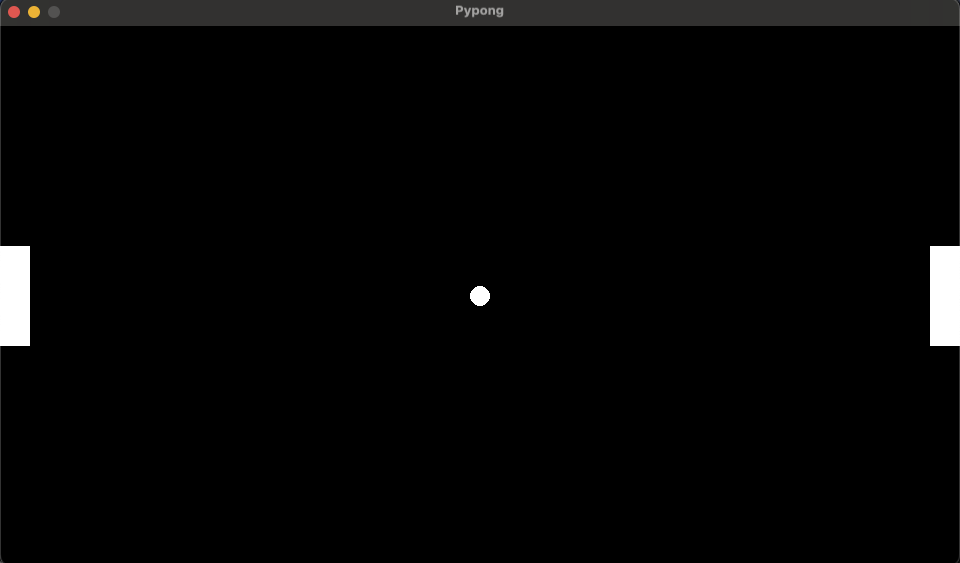

# Pypong

The Pong game coded in Python using the [Pygame](https://www.pygame.org/news) library.



## Run Locally

Clone the project

```bash
git clone https://github.com/iddahadev/pypong.git
```

Go to the project directory

```bash
cd pypong
```

Create a virtual environement and activate it

```bash
python3 -m venv .venv
source .venv/bin/activate
```

Install the dependencies

```bash
pip install -r requirements.txt
```

Run the script

```bash
python main.py
```
